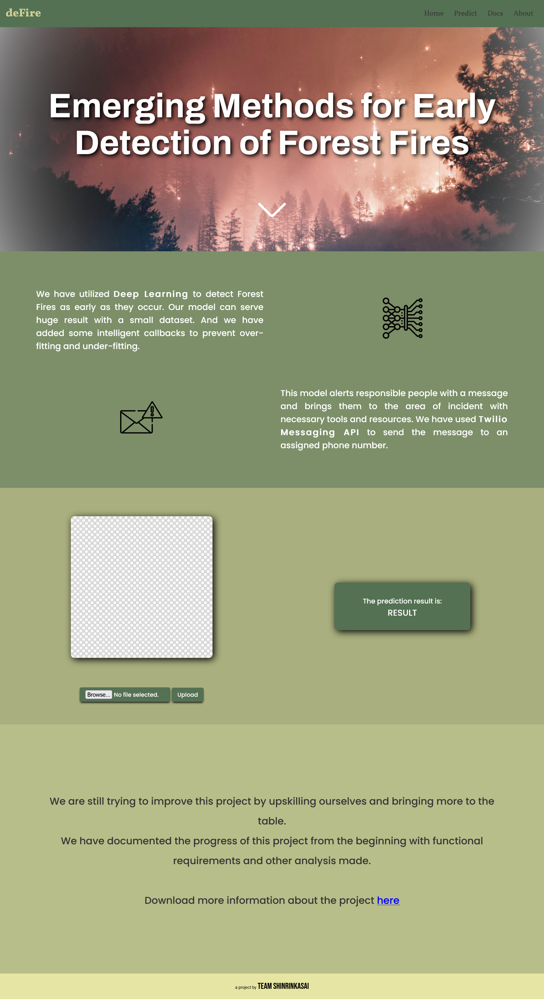
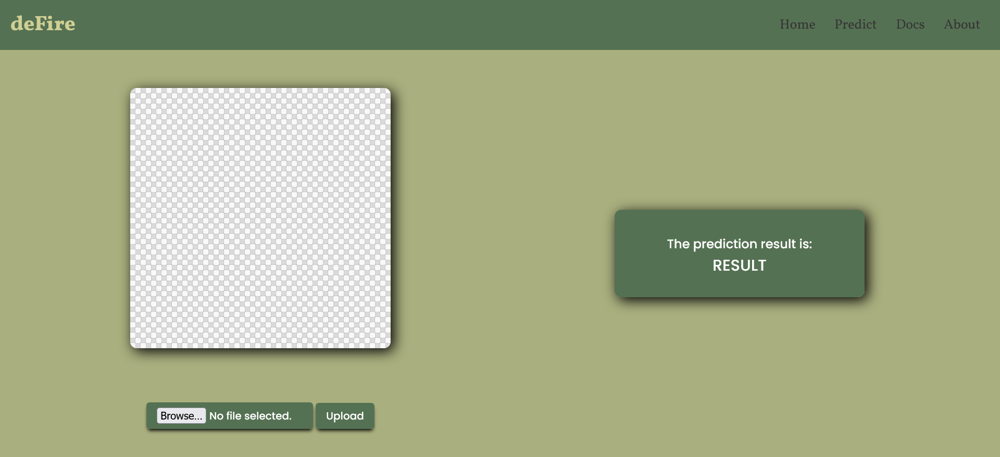
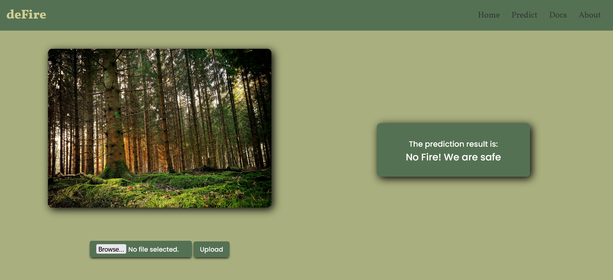
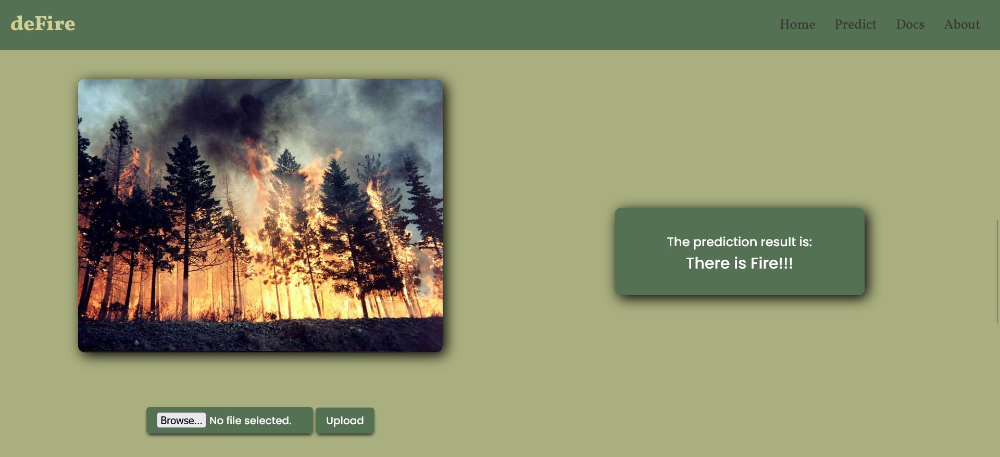

# Emerging Methods for Early Detection of Forest Fires

## Sprint 4

### Files submitting for Sprint 4 are as follows:
- A **README** file which includes a link to the website we have deployed in Azure for demonstrating our model
- This file also includes some **screenshots** from our website to show its functionality.

### Project Link
Link - [project site](https://forest-fire.azurewebsites.net)

### Working features
- We can upload an image to the website to detect if the picture includes a forest fire or not which demonstrates our model that we have built and deployed in IBM.
- We can also download our detailed documentation of our project as .pdf file.

### Screenshots

